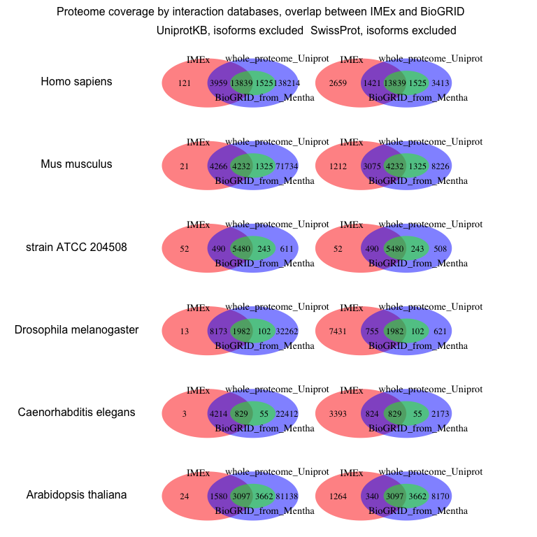
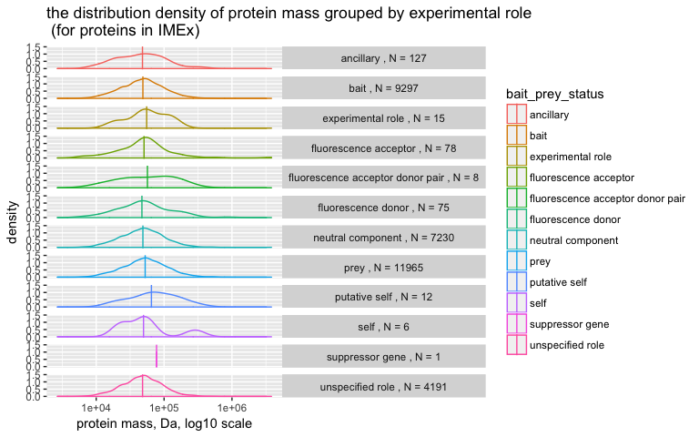

# Characterisation of model species interactome available from primary molecular interaction databases
Vitalii Kleshchevnikov  
21 December 2016  

 

The report was published on 2017-04-26. All data used in the report as available on 2017-04-24.

# Outline

1. Abstract
2. Introduction
3. Methods
4. Results and discussion
    - how available interactome covers the proteome
    - IMEx(IntAct) vs Biogrid
    - which proteins are missing
    - interaction detection biases
    - study bias: the more articles, the more interactions
    - which proteins are IMEx(IntAct), Biogrid and high-throughput datasets enriched in?
5. Conclusion  

# Abstract

# Introduction 
 
   The structure and the function of the cell arise from interactions between molecules inside and outside it. Though proteins, nucleic acids, lipids and small molecules can all form important interactions, studies and literature focus mainly on interactions between proteins and other macromolecules. We can discover and study these molecular interactions using a number of experimental and computational techniques. This study focuses on molecular interactions identified in the experimental setting, most of which are represented in the literature and databases by protein-protein interactions (also protein-DNA interactions obtained, for example, by ChIP-Seq, but those are traditionally incorporated into genomic databases).  
 
   Based on the information detection methods can provide towards ground truth we can classify interactions in three types: binary interactions and associations. Binary interactions are the interactions between two components, for example, two specific proteins, some detection methods (e.g. two-hybrid) identify those. To understand associations, we need to imagine we know proteins A, B and C constitute a complex and interact as shown in a figure 1 A. When we conduct an experiment, we choose the bait (the molecule experimentally treated to capture its interacting partners - called preys) to be protein A, and by detection method (e.g. affinity-purification mass spectrometry) we get both protein B and protein C detected as preys. Next step is to translate bait-prey relationship into a model of reality like the one shown in the figure 1 A. We call interactions between A-B and A-C associations because we cannot infer the true relationship between A, B, and C from this experiment design. In the other words, establishing that proteins are in direct physical contact is really challenging. However, to represent associations in a tabular format with each row corresponding to one interaction (e.g. A-B) we need to expand those. Two ways are commonly used to expand interactions, hub and spoke expansion, both shown in the figure 1 B. 

#### Defining interactome

   The aggregation of all components and their interactions into a single network result in what we call interactome, the whole of all molecular interactions. You can also look into the subset of this network, for example, you can select only proteins, only those proteins that are expressed in the brain, and only the interactions between this protein identified experimentally in the brain cells. This example reflects the complexity and the diversity of the interactome - which is what you would expect from a system underlying the complexity and the diversity of the cell types, cellular behaviours, and functions. For the same reason, only by studying these interactions and how they change in specific cell types and under specific circumstances in combination with the functional analysis we can decipher cellular regulatory networks. The ultimate goal of the research in the field would be to capture all physical interactions and thoroughly describe them while avoiding false discoveries. 

#### Experimental approaches for discovering interactions

   Experimental protein interaction detection methods can be classified into 3 main categories based on the evidence they provide and whether they can be used in a high-throughput manner:
The first category is formed by methods using affinity purification of the bait and all the prey associated with it. Following that, preys can be identified using western-blotting and specific antibodies or using mass-spectrometry, which can be done in a high-throughput manner [Mann, ]. The main advantage of these methods is the ability to quantitatively characterise interactions [Mann, ] and capture many prey proteins per bait - the latter, however, presents the disadvantage of dealing with associations. The main disadvantage of these techniques is that for the reliable result it requires all interacting proteins to be soluble []. 
   The second category is formed by protein complementation techniques which include two-hybrid (transcription factor complementation), the most widely used interaction detection method (including high-throughput experiments). In this method, pairs of proteins are tested for interaction and therefore all discovered interactions are binary (the main advantage of this method). Classic implementation of two-hybrid requires proteins to be soluble as well [], however, two-hybrid for membrane proteins was also developed []. The main disadvantage of two-hybrid methods are that they allow only qualitative characterisation of interactions [], are usually performed in yeast (thus, have a lower sensitivity) and are highly prone to false-positive results [].
   Final category consists of methods based on the structure of the protein complex. They can provide valuable information on how exactly physical interaction occurs but as for now are extremely labor-intensive and will always need complementary experiments showing if the proteins actually interact in the cellular context.

#### Challenges of interactomics

   Four big challenges substantially complicate the study of molecular interactions, especially on the whole organism scale. The first being that we don't know the true nature of underlying our experimental results (all assays provide evidence that interaction is possible and some can provide quantitative description, but all are prone to error and the problem described in the figure 1 A) which lead to the necessity of combining interaction data from multiple experiments and complex statistical evaluation of how probable the interaction is based on that data (Bayesian approach [1]) rather than receiving confident yes-or-no result from single experiment. Interaction databases make an effort to score the interactions based on supporting evidence, however, this is usually done with non-probabilistic heuristic approaches, like MI score [PMCID: PMC4316181]. 

   The second big challenge is the problem of "noise" - or false positives. Different interaction detection experiments are prone to these errors for different reasons, for example, in-vitro experiments (e.g. TAP-MS) may allow the interaction between proteins which are normally included in separate cellular compartments. Specific groups of proteins (based on their physical or chemical properties) may have a higher susceptibility to false positives, for example, intermediate filaments (e.g. nuclear lamins) have low solubility under non-denaturing conditions necessary for affinity-purification based techniques, which may lead to artifactual results. However plausible, this particular problem lacks empirical evidence and requires more investigation. A more general problem of noise will be addressed by more proteome-scale interactomics experiments (which can include enough samples to guarantee low false positive rate while still identifying interactions).

   The third big challenge is that our knowledge of interactome is incomplete and arises from the fact that experimental approaches have low statistical power and often miss out some real interactions. Also, many proteins, especially for non-popular model species, were not researched for protein interactions.

   The final challenge contributes to the "incomplete interactome" problem but is grounded in the fact that not all protein interaction discovered and published are included in protein interaction databases. In the other words, this is database curation problem. More than 100 public databases containing protein interactions are available now. These databases differ:
- by the types of data they include (e.g. computational prediction, manual curation from experimental articles - primary, aggregated data from many primary databases - secondary),  
- the level of detail captured from articles to describe interactions,  
- how often and if they are updated with new data.  
   The level of detail ranges from only mentioning the pairs of interactors and heuristic score assigned to them (STRING, updated once in 2 years) to the ones containing experiment details (detection method, bait/prey status, if available - quantitative data, experiment setup, protein variants), such as IntAct [PMCID: PMC3703241]. 
   The amount of interaction data generated per year is growing exponentially making manual curation of all this data into primary databases a daunting task. To prioritise curation efforts and reduce redundancy between databases (to curate different data using the same standards) IMEx consortium was formed in 2012 [PMCID: PMC3703241]. IMEx-compliant databases include all big primary databases excluding only BioGRID (which curates at the lower level of detail) and not active legacy databases.

#### Motivation for this study

   Solving some of these challenges may be easier than the others. In particular, to solve the last challenge we can prioritise curation efforts for already published interactions to cover unrepresented proteins and we can encourage authors to submit their results to the databases prior to publishing. We can also encourage research of underrepresented parts of the interactome. However, for both of those aims, we need to characterise the interactome already present in interaction databases. Specifically, to learn how available interactome covers the proteome of main model species, if there are any biases to proteins with no available interactions and if any major protein interaction detection methods exhibit any biases towards specific groups of proteins. 
   The other helpful to look at the problem is to search for underrepresented in interaction databases but in general well-researched proteins.

# Aims of the study 

1. Find out how available interactome covers the proteome of main model species. Considering either all UniProtKB or SwissProt entries only as the proteome (canonical identifiers as well as protein isoforms). Consider all interactions from IMEx-compliant databases as interactome.  

2. Compare the coverage of proteome by interactome from IMEx to the interactome from BioGRID (the other major primary database).

3. Find out if proteins with no available interactions stand out by specific functions (Gene Ontology, GO: biological process and molecular function), cellular localisation (GO), molecular mass, or protein evidence status from SwissProt

4. Find out if major protein interaction detection methods (two-hybrid and AP-MS, AP-WB?) exhibit any bias towards biochemical properties of the proteins involved (mass, disordered regions, hydropathy, the fraction of charged residues)

5. What is the relationship between the number of interactions or MI score and the number of publications or GO terms per protein?

6. Are proteins with a higher fraction of intrinsically disordered domains more likely to have interactions available and do they have more interactions (if normalised for how well-studied proteins are)?

7. Find out if there are any proteins which are in general well researched (many associated publications or manual GO annotations) but underrepresented in IntAct (low MI score)

8. If that is possible to measure: do intermediate filaments (or other highly insoluble proteins) really have higher rates of false-discovered interactions?

# Methods - data processing and analysis

### Getting proteome from UniProtKB

   Whole proteome (all UniProtKB) for each species was downloaded programmatically in R using UniProt rest API. SwissProt-proteome was subset from the whole proteome by reviewed status column. UniProt identifies proteins by UniProtKB/AC (e.g. P04637, accession) which does not distinguish between protein isoforms. UniProt aggregates isoform information and identifiers (e.g. P04637-4) in a separate column with zero to many isoforms per each UniProtKB accession. To generate proteome list which includes protein isoforms, isoform accessions were extracted and combined with the list of generic accessions. In this analysis, protein evidence status and protein mass are only attributed to generic accessions. 

### Getting and transforming interactome data from IMEx databases and BioGRID

   Interactome from all IMEx databases was downloaded programmatically in R using PSIQUIC package from Bioconductor [Paul Shannon (2015). PSICQUIC]. IMEx databases include IntAct, MINT, bhf-ucl, MPIDB, MatrixDB, HPIDb, I2D-IMEx, InnateDB-IMEx, MolCon, UniProt, MBInfo. The list of interactions (pairs of interactors) was transformed into the list of interactors preserving interactor identifiers, the type of interactor identifier, species information and the database interaction originates from. Only unique proteins wereIMEx databases contain interactions between proteins, RNA, DNA and small molecules, moreover, these interaction may involve molecules originating from different species. Therefore, to perform by species interactome/proteome comparison there is a need to remove non-UniProtKB/AC molecule identifiers (which removes non-protein molecules, although, may also remove a small fraction of proteins which have no UniProtKB/AC) and there is a need to remove proteins originating from other species. Also, entries in IMEx databases has to be cleaned of tags and textual descriptions ("taxid:9606(human-h1299)|taxid:9606(Homo sapiens lung lymph node carcinoma)" to "9606") to make further analysis easier and cleaner.
   Next, when provided in the research articles protein isoform information is always included in IMEx databases, so to perform analysis excluding isoform information UniProtKB/AC were cleaned of -N suffix (P04637-4 to P04637).

### Disordered regions and physical properties

   Information on disordered region content and biochemical properties of individual proteins were obtained from the dataset generated by Vincent and  Schnell in 2015 []. Briefly, Vincent and  Schnell used a number of disorder prediction algorithms (IUPred and DisEMBL) and their consensus to generate disordered region predictions for each protein which was be used to calculate the fraction of disordered regions in a protein. In addition, Vincent and  Schnell used localCIDER version 0.1.7 (Classification of Intrinsically Disordered Ensemble Regions) to calculate physical properties such as a fraction of charged residues, mean hydrophobicity or charge separation for each protein. This was done for 10 eukaryotic proteomes and written to SQLite-database which was made available online.

### Gene ontology enrichment analysis

   coming soon
   
# Results

## 1. How well available interactome covers the proteome

### Available interactome covers substantial fraction of the reviewed proteome of main model species

   In this section, we compare the list of all proteins (per species) in Uniprot (reviewed part (or SwissProt) - Figure 2, reviewed and unreviewed parts (or all UniProtKB: SwissProt + trEMBL) - Supplementary Figure 1) to the list of proteins which have interaction partners annotated in IMEx consortium databases. 
   Non-canonical protein isoform identifiers (P32054-1) were converted to canonical identifiers (P32054) resulting in interactions "any isoform to any isoform" (Venn diagrams on the right) or isoform identifiers were preserved (Venn diagrams on the left). You can see that adding isoform information adds more proteins to the SwissProt list but not so many proteins to the IMEx list.

   Overall - the best interactome annotated by IMEx databases is baker’s yeast, 2nd best interactome is *E.coli*. All other interactomes cover less than the half of their respective proteome (all UniProtKB, Supplementary figure 1). The overlap between the interactome and reviewed proteome (SwissProt) is significantly better. 
   A large fraction of human, mouse, arabidopsis proteins-interactors and more than a half of drosophila and *C.elegans* proteins-interactors are absent in SwissProt (but included in trEMBL) – suggesting under-annotation by the SwissProt-Uniprot team.
Protein isoforms (in multicellular model organisms) are almost not annotated in the interactome. Human is an exception – 2656 protein isoforms out of 22049. Other molecular interaction databases (active BioGRID, inactive HPRD) do not record isoform information.

## 2. BioGRID database (as obtained from Mentha) overlaps significantly with IMEx databases

   BioGRID database is the second major primary protein interaction database which when combined with IntAct contains all interactions information which has been curated to currently active public databases (major inactive or legacy databases include HPRD and BIND). BioGRID is characterised by shallow curation level (retains only some information about the interaction and the experiment) and identifies proteins using Entrez Gene ID while IntAct uses UniProtKB identifiers. Entrez Gene ID does not allow to distinguish between different protein isoforms. In our analysis, this difference introduces additional mapping step (Gene ID to UniProtKB). Mentha database has imported all BioGRID-stored interactions and has mapped Gene ID to UniProtKB, so we used Mentha to get BioGRID-stored interactions. Mentha doesn't import interactions for *E.coli*, therefore *E.coli* is absent in this analysis.
   BioGRID has recently incorporated a large-scale study aimed, in part, for find interacting partners for the proteins missing them []. 

   Overall, BioGRID overlaps with IMEx to a large extent. Nonetheless, for all of the species we have looked at, BioGRID has annotated some proteins (and their interactions) which are not annotated in IMEx. BioGRID stores substantially more interactions for arabidopsis and quite a lot of human and mouse interactions.

##3. Mouse and human proteins are commonly combined for interaction experiments

   The fact that researchers tend to put proteins from other species (mostly human) into mouse experiments or tend to put mouse proteins into cells from other species (mostly human) is also common for interaction detection experiments and is clearly seen in figure 3: half of the mouse interactors are from the other species. This holds true both for IMEx databases (figure 3) and for BioGRID. However, this analysis doesn't show which proteins (mouse or human) were used as bait to capture interactions in which cells (mouse or human).

   Figure 3 also displays how many interactors do not have Uniprot identifiers - those are small molecules, RNA, DNA or a small fraction of proteins not mapped to UniProt. Big fraction of *C.elegans* interactors are coming from single experiment mapping transcription factors to their sites []

   Interchangeable use of mouse and human proteins generates interaction data which is hard to reuse and introduces imprecision due to the fact that it requires the mapping between homologous proteins. However, this may not be the biggest problem with studying the interactions between mouse and human proteins and trying to correctly interpret results. Recent studies of intrinsically disordered proteins show that linear amino acid motifs located in disordered regions frequently mediate protein-protein interactions [], for example, the disordered region of p53 mediates its ability to recruit transcription-activating proteins to the promoter []. More importantly, these linear amino acid motifs can evolve quickly, for example, allowing cancer cells to escape control by P53 []. So, while the interaction between mouse protein A and human protein B can exist, that might not be true for the interaction between human protein A and human protein B, and vice-verse.
   On the other hand, some researchers advocate that interactions important for the cellular function should be conserved between species [].

   Surprisingly, 19438 interactions between mouse and human proteins were discovered in human rather than mouse cells (only 1233) suggesting that researchers use mouse rather than human proteins as baits (1158 mouse baits total, 5606 human preys total, including isoforms, from 441 publications) to find interactions directly relevant to human interactome research, including human disease.
   

## 4. Which proteins are missing interaction evidence?

   Characterising the properties of proteins missing interaction evidence can help prioritise curation efforts. By looking for proteins missing interaction evidence and involved in particular biological function (as described by Gene Ontology) or particular disease we can complete missing part of the interactome.

### Olfactory receptors are a major group of human proteins not represented in IntAct

   coming soon

<!-- --><!-- -->

<!-- -->

<!-- -->

### Human proteins with no available interactions (from IMEx) are on average shorter than the proteins with interactions available  

   Protein length or mass are physical properties of a protein which can, in theory, influence it's usage as a bait in experiments and it's detection in case methods depend on protein length. Proteins length is also important biologically. Longer proteins can have multiple functional domains and, therefore, more interactions.
The distribution of protein mass has a very long right tail - there are much more big proteins than a normal distribution would predict (Supplementary figure 3), which only allows using non-parametric statistical tests (Wilcox test). Log10 transformation of protein mass, though, makes extreme values less extreme and is approximately normally distributed.

This difference in protein mass between proteins present and absent in the interactome is highly unlikely to occur by chance (Wilcox rank test (Mass, Da, 95% confidence interval: -13000, -11100, p-value: 6.76e-142) and Student t-test(log10 of Mass, Da, 95% confidence interval: -0.153, -0.132, p-value: 4.68e-143) on the whole population of proteins, Monte-Carlo sampling (is it useful?), permutation of labels followed by Wilcox rank test (is it useful?) - Supplementary figure 3,4,5). Removing 416 olfactory receptors, evidently, does not change this trend (Wilcox rank test on Mass, Da, 95% confidence interval: -12800, -10800, p-value: 2.98e-121).

### Major experimental role types (bait/prey/neutral component) are not substantially influenced by the mass of the protein

The experimental role of the protein (bait/prey/neutral component) can, in theory, be influenced by protein mass. For example, it may be easier to clone shorter proteins for use as bait/prey. So it important to see if the experimental role is really influenced by protein mass.

 
 
   We can now select only the most frequent experimental roles

   Evidently, the experimental role of a protein is not substantially influenced by the mass of the protein.

### Most of the human proteins with no available interactions (from IMEx databases) are membrane proteins

   coming soon

### If a protein is missing protein evidence in Uniprot it is also more likely to be missing from IMEx databases

   coming soon

## 5. Proteins missing interaction evidence are not associated with specific disease

<!-- -->

## 5. Do major protein interaction detection methods (two-hybrid and AP-MS) exhibit a bias towards biochemical properties of the proteins involved?

   The problem of bias in interactomics is often discussed in research papes and in the community. Now we will focus on the bias in the experimental detection method. We choose to compare two major families of methods: two-hybrid and affinity-purification-mass-spectrometry (AP-MS). We define two-hybrid using PSI-MI ontology: detection method = "transcriptional complementation assay" (MI:0018) - all methods which belong to this type (which are children terms in the ontology). We define AP-MS using two PSI-MI ontology terms: detection method = "affinity chromatography technology" (MI:0004) and participant identification method = "partial identification of protein sequence" (MI:0433). 
   We get interactions detected using these methods by querying PSICQUIC. We use word formulations rather than ontology term identifiers because PSICQUIC package in R is not equipped to handle quotes in the query text ("MI:0004" AND "MI:0102").

### AP-MS is biased towards longer proteins

   Unlike the experimental role type, whether a protein interaction is detected using a particular interaction detection method is influenced by the mass of that protein.

   The statistical significance of the difference in protein mass across protein detection methods was tested using linear model approach. Linear model offers way to perform multiple statistical tests (ANOVA and posthoc ttests) in R. Linear model takes a group assignment for a protein (only two-hybrid, only AP-MS, both two-hybrid and AP-MS, other methods - a vector 0s and 1s where 1 show which group a protein belongs to) and the mass of that protein. Using these parameters for each of the proteins linear model can learn the mean of each group as well as provide a way to calculate errors for each of the between-group comparisons. The robust linear model used for this test is less sensitive to the extreme values.
   The results of statistical tests can be visualised on a plot. In the box plot below, each vertical arrow points to the mean mass of the proteins in a particular group. The middle line of the boxplot represents a median which happens to coincide with mean because the distribution of logarithm base 10 of mass is approximately normally distributed.
   Each yellow arrow shows the p-value and the difference in protein mass between two corresponding groups.

   The figure X shows that the mass of the proteins which were identified interacting using AP-MS technique is on average higher that the mass of the proteins identified using two-hybrid or the other methods.

## 6. The number of interactions (or MI score) is associated with the number of publications

   The problem of better-studied proteins having more interactions despite all proteins having similar amounts of Mendelian-type mutations and therefore similar functional significance has been discussed in the literature a few years ago []. So we decided to have a fresh look and explore the problem more deeply.
   Interaction is defined by two proteins which form it regardless of how many times these proteins were spotted interacting. MI score is an empirical score proposed by IMEx consortium to evaluate the evidence that supports each given interaction []. Not every interaction has enough evidence to get an MI score. We have counted the number of interactions for each protein (Figure 8) and summed MI scores over interactions for each protein (Figure 9, this can be seen as the number of interactions combined with the confidence we have for their existence). We define a large-scale study as a study which provided more than 100 interactions in IntAct (counting by interaction identifiers).
   The number of publications per gene was counted using NCBI gene to PubMed ID conversion table.
   
   

   Just to be clear: for each protein which has all interacting partners identified exclusively by large-scale studies, or small-scale studies, or both large-scale and small-scale studies we show the number of interacting partners (which were indentified in those three types of studies) and the number of publications, any type of study involving the gene which codes for that particular protein. 
   To emphasise, in the figures below, we do not examine whether the same protein has a different number of interacting partners coming from large-scale or small-scale studies, we aggregate all those proteins into one group and count the total number of interacting partners each protein has (each particular interaction may have been identified in many large-scale studies, or many small-scale studies, or both large-scale and small-scale studies).
   
   The figures below show the number of interacting partners associated with the number of publications (x-axis) for different species and the scale of the experiment (split into individual graphs). The trendline was fitted to the data using robust linear regression (blue line) which less sensitive to outliers than linear regression (red line) and is, therefore, able to better capture the relationships. Both axes are log-transformed (which means linear trendline will stay linear if remove log transformation - log-transformed scale only allows to visualise individual points better).
   

   
   Now, we can separate proteins whose interacting partners were indentified in both large and small scale studies into separate group and see how that can change the trend.

   Evidently, the difference in trend observed is only subtle, suggesting large scale studies (more than 100 interactions) are still biased towards more studied proteins.
   
   We can increase the thresold we use to define large scale study from 100 interactions per study to 1000 interactions per study to see how that influences the trend.
   

   Figure above suggests that studies which have identified more than 1000 interations (not covered by any of the small-scale studies) are less biased towards better researched proteins. Studies in yeast and *C.elegans* are notable exceptions: they still discover more interacting partners for better researched proteins. In contrast, human large-scale experiments tend identify more interacting partners for less researched proteins. This is not surprising since many of those studies aim to identify interacting partners for proteins with no known interacting partners.
   
   The fact that the study of any scale identifies more interactions for proteins which are well studied (even large-scale studies, 100 interaction/study threshold) may arise from the fact that if two studies search for interacting partners of the same protein they are going to find some interacting partners specific to a study. Therefore, as soon as we analyse overlapping studies (including large scale) we will have more interacting partners for better studied proteins. Therefore, any study which relies on combining multiple interaction datasets should use algorithms [] to account for study bias.
   
   
   Median MI score reflects how well studied are on average interactions between given protein and it's interacting partners.
   The figures below show the median MI score for interactions and how it relates to the number of publications (x-axis) for different species and the scale of the experiment (split into individual graphs). The trendline was fitted to the data using robust linear regression (blue line) which less sensitive to outliers than linear regression (red line) and is, therefore, able to better capture the relationships. Both axes are log-transformed (which means linear trendline will stay linear if remove log transformation - log-transformed scale only allows to visualise individual points better).

  You can clearly see that the more studied overall the gene is (the more publications per gene there is) the more interactions proteins encoded by that gene tend to have and the more evidence there is for those interactions. Which is not surprising because journals tend to publish novel interactions, and the more studies there is overall - the more studies look into protein interactions. What is quite surprising is that large scale experiments also exhibit this trend. The exception is human and mouse large scale studies, where recent datasets specifically attempted to find interactions for understudied proteins[].
  In this analysis, MI score for each interaction incorporates the evidence from any interaction detetection experiment and we are not able to separate the score for proteins studied in both large and small scale studies (which we do in the next chapter). 
  
  
### MI score based on either large- or small- scale experiments
  
  By taking recalculating MI score based on either large- or small- scale experiments (by separating the effects) we can get a better estimate the publication bias in those types of studies. We used the threshold of 100 to define large-scale study.

### The number of interactions and publication separated by interaction detection method
  

You can notice that trendlines for different methods are located at different heights, which tells us that different methods identify a different number of interactions across both large and small scale studies. Some trends are not meaningful due to a low number of proteins contained in the group they describe. 

The plot below shows how the distribution of the number of interacting partners depends on the protein detection method. Spoke expanded interactions are included.

<!-- -->

  The number of interaction IDs per protein relates to the number of experiments (not publications or interacting partners) in which interaction between given protein and it's interacting partners was detected.

<!-- -->

   The number of interacting partners should be linearly dependent on the number of experiments they were detected in

<!-- -->

Comparison of figures which relate the number of interacting partners to the interaction detection method and how well those proteins are studied suggests that proteins have the more interacting partners the more experimental attempts were done to identify them and if the proteins were studied using different interaction detection methods. This supports the idea that different interaction detection methods identify different interactions based on each method bias (as discussed in the chapter 5). 

## 7. Proteins with no interacting partners are less studied overall

   Proteins without interacting partners annotated in IMEx are less studied overall both in yeast, human and mouse (species with different available interactome coverage). In fact, many of these proteins lack evidence at the protein or transcript level (as shown in Uniprot).

<!-- -->

## 8. Are proteins with a higher fraction of intrinsically disordered domains more likely to have interactions available?

### interaction information is not available for proteins with similar fraction of intrinsically disordered domains

   Is not exactly clear - more research in needed. The dataset generated by Vincent and Schnell has weird consensus disordered domain prediction (combining many prediction algorithms) while individual disordered domain prediction algorithms show contradicting results. For better quality disordered domain prediction we can use MobiDB (http://mobidb.bio.unipd.it), however, it's API is not very usable for proteome-wide study (it only allows to query protein by protein (other options are not very useful) and no more that 1 request/sec).
   Plots below show the distribution and the distribution density of the fraction of disordered regions (split by prediction algorithm) in a protein and the presence of that protein in IMEx databases.
   
<!-- --><!-- -->

### proteins with interaction information available tend to have higher fraction of charged residues and lower mean hydropathy

The fraction of charged residues and the mean hydropathy are the physical properties of the protein which can influence protein's solubility and disorderliness.

<!-- --><!-- -->

P-values for the differences: 0.000000000000000000000000000000000000000000000000000000000000000000000000000000000000000000001114866, 0.000000000000000000000000000000000000000000000000000000000000000000000000000000000000000000001114866, 0.000000000000000000000000000000000000000000000000000000000000000000000000000000000000000000001114866.

<!-- --><!-- -->

P-values for the differences: 0.000000000000000000000000000000000000000000000000000000000000000000000000000000000000000000001114866, 0.000000000000000000000000000000000000000000000000000000000000000000000000000000000000000000001114866, 0.000000000000000000000000000000000000000000000000000000000000000000000000000000000000000000001114866.

Proteins which don't have interaction evidence in IntAct tend to have a lower fraction of charged residues and higher mean hydropathy. This correlates well with the GO (cellular component) enrichment result: these proteins are largely membrane proteins (this was done in Cytoscape, not in R yet).

## 9. Do proteins with a higher fraction of intrinsically disordered domains have more interacting partners?

  Recent attempt to correct for the study bias (explored in the previous chapter) while accessing whether a particular group of proteins form higher (or lower) number of interactions by Cerrano group [PMCID:PMC4523822] showed that it's possible and important to do so. Performing this correction as described in Cerrano's paper can allow evaluating whether proteins with intrinsically disordered domains actually form more interactions.
  One previous study [PMID:18924110] has already pointed out that proteins with disordered domains are more likely to be detected in protein interaction screens in yeast. We test whether that's true across multiple species.
  
### The number of studies vs the fraction predicted disordered regions

  As an alternative to splitting proteins into the ones which have long disordered domains and which don't, we can look at the continuous fraction of disordered domains. This measure can be less influenced by study bias.

  The plot below shows the relationship between the fraction of disordered domains and the number of publications. 

  
<!-- -->
  
  The second plot is a quantile-quantile plot which shows that the distribution of the fraction of disordered domains is far from normal. Square root or logarithmic transformations do not change that.
  
<!-- -->

   From these graphs, we can conclude that the fraction of disordered domains can vary depend on the number of studies and disordered region prediction algorithm (which may reflect the bias of disordered region prediction algorithms.

### Proteins with a low fraction of disordered domains tend to have fewer interactions

   If disordered regions are often needed for molecular interactions we would expect that proteins with a higher fraction of disordered regions will tend to have more interacting partners (irrespective of the study bias).

<!-- -->

   As you can see from the loess-fitted curve (red, loess stands for local polynomial regression), the proteins with a low fraction of disordered domains tend to have fewer interactions while further increasing the fraction of disordered regions doesn't change the trend. The more general trend is shown in blue - robust linear regression. 
   Whether these trends are the result of chance or study bias is yet to be tested.

### The longer yeast protein is the more interactions it has (doesn't hold true for mouse)

   In theory, the length of the protein can influence the number of interaction partners of the protein: the longer the protein the more functional and structural domains it has and the more molecular interactions that function will require.
   
<!-- -->

   The analysis shows that the number of interacting partners correlates with the protein length in yeast, but not in human or mouse.
   
### The length of the disordered regions and the number of interactions
   
   The sum length of disordered regions per protein can be a better predictor of the number of interacting partners because it captures both the presence of disordered regions and the fact that longer proteins have more functional domains. 

<!-- -->

## 10. The number of protein domains (InterPro) and the number of interactions

<!-- -->

<!-- -->

coming soon

# Supplementary figures

Supplementary figure 1 

      

